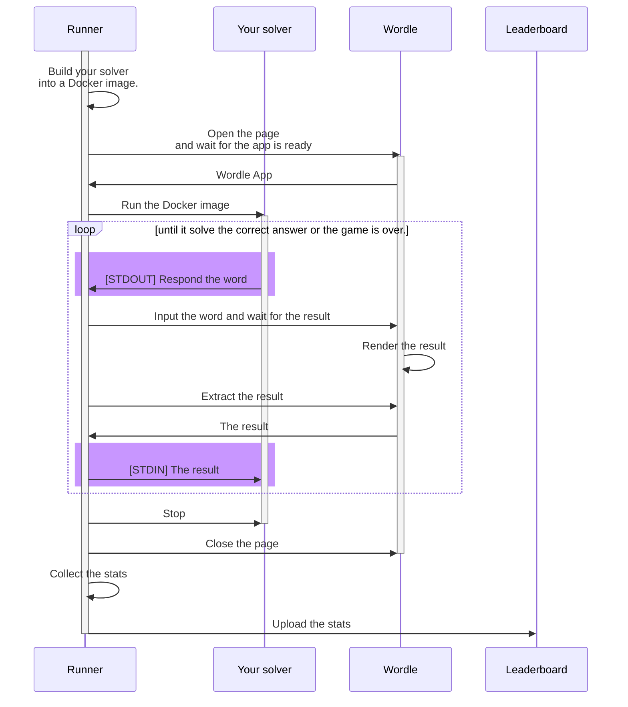

# Wordle solver leaderboard

[Wordle](https://www.powerlanguage.co.uk/wordle/) solver leaderboards.

- :checkered_flag: **Implement a solver that requires less number of turns to solve less execution time.** The fewer the number of turns required, the shorter the execution time for the same number of turns, the higher the rank.
- :man_technologist::woman_technologist: **You can focus on implementing the algorithm.** All you need to do is to implement a simple REPL program. The measurement tool will interact with your solver, manipulate the browser, and calculate your score.
- :clock12: The leaderboard will be updated automatically every day around 12am UTC.

You can see the leaderboard here.
https://www.wordle-solver.dev/

## Runtimes

Right now, we support these languages.

- Node.js (v16.x): [reference implementation](https://gist.github.com/Leko/098674d7a571fd139bcffd73eedff707)
- Rust (v1.58): [reference implementation](https://gist.github.com/Leko/125e92a263043debc36f5aa895bfd015)
- Deno (v1.18)

Do you need a runtime in a different language than above? [CONTRIBUTING](./CONTRIBUTING.md)

## How to participate

Please refer to [CONTRIBUTING.md](./CONTRIBUTING.md).

## How the runner works

- When the process starts, first output the first word and new line character (`\n`) to STDOUT.
  - ex. `count\n`
- The response from Wordle will be given as a CSV to the STDIN
  - ex. `correct,absent,present,present,correct\n` (:green_square::white_large_square::yellow_square::yellow_square::green_square:)
  - `correct` = :green_square:
  - `present` = :yellow_square:
  - `absent` = :white_large_square:
  - If all the parts are `correct`, it means that the word you chose is the correct answer. Please terminate the process.
- If the word output by solver is not registered in Wordle, the special string `NOT_IN_WORD_LIST` will be given to the STDIN. In that case, output a different word to STDOUT.

## Regulation

- STDOUT should be used only for responses to runner. All debug and error logs should be output to STDERR. The logs will be automatically collected and can be viewed on the [execution detail page](https://www.wordle-solver.dev/history/Leko/222).
  - Please keep logging to a minimum. Logs will be automatically truncated to save space.
- Please don't rely on OS-specific features. It can be changed.
- Please don't access to the internet.
- If your solver process has been running for more than 3 minutes, it will be forcibly killed. In that case, the answer will fail and neither the number of turns nor the execution time will be displayed.
- If there is a problem with a contestant's code that causes a problem with the system, it will be removed without notice.
